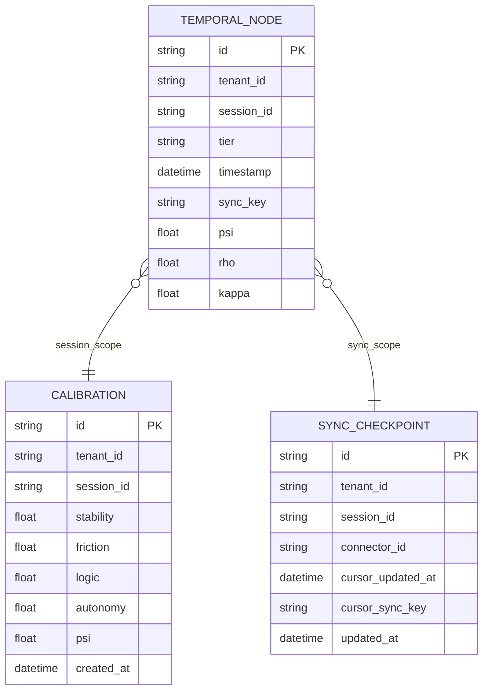
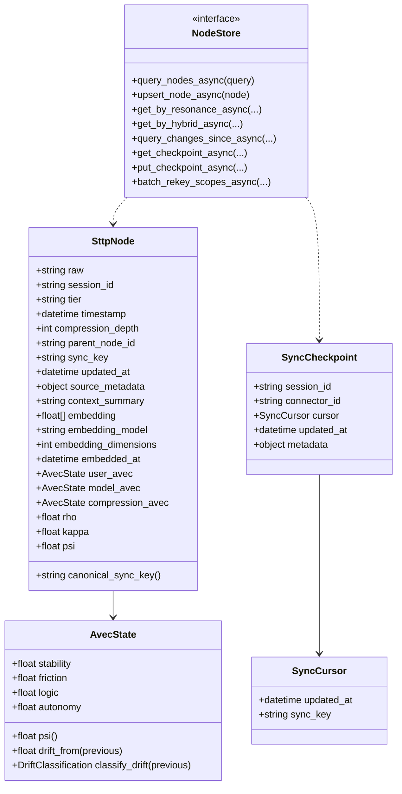
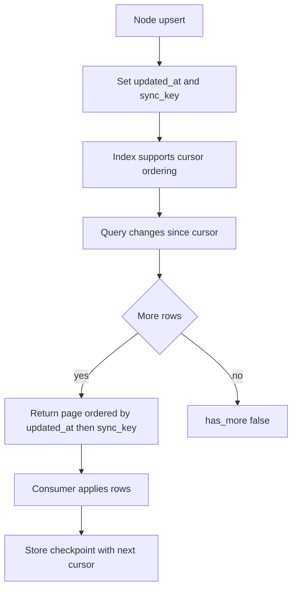

# Locus Core Database Schema and Data Governance

## Document Control
- Document ID: LOCUS-CORE-DATA-ARCH-001
- Status: Current
- Intended Audience: Platform Engineers, Data Engineers, Reliability Engineers, Security Reviewers
- Source of Truth: `locus-core-rs` implementation (`domain/models.rs`, `storage/surrealdb/*`, `domain/contracts.rs`)
- Last Updated: 2026-05-04

## Audience and Use

This document is for teams evaluating data durability, query behavior, and operational safety before adopting Locus in production systems.

Use it to:

1. Validate persistence and indexing behavior against your workload.
2. Understand multi-tenant and compatibility rules.
3. Review storage-level guarantees before integration and rollout.

## 1. Purpose and Scope
This document specifies the persistence model used by `locus-core-rs` for STTP memory nodes, calibration records, and synchronization checkpoints.

It covers:
- Physical schema implemented in SurrealDB.
- Logical entity relationships.
- Idempotency and uniqueness rules.
- Multi-tenant and legacy-compatibility behavior.
- Query, indexing, and lifecycle constraints.

It does not cover:
- HTTP/gRPC transport contracts (documented in gateway docs).
- UI-facing DTO contracts (documented in SDK interface docs).

## 2. Architectural Context
`locus-core-rs` defines a storage abstraction (`NodeStore`) with two concrete implementations:
- `InMemoryNodeStore` for tests and ephemeral execution.
- `SurrealDbNodeStore` for persistent runtime.

All persisted shape definitions and indexes in this document correspond to `SurrealDbNodeStore` schema initialization.

## 3. Canonical Logical Model

## 4. Domain Model Alignment (UML)

## 5. Physical Schema (SurrealDB)
### 5.1 Table: `temporal_node`
Storage purpose:
- Authoritative persisted STTP node record.
- Supports retrieval, ranking, sync, and transform operations.

Key characteristics:
- `SCHEMAFULL` table.
- Unique identity by `(tenant_id, session_id, sync_key)`.
- Temporal ordering by `timestamp` and `updated_at`.

Required fields:
- Identity and scope: `tenant_id`, `session_id`, `sync_key`.
- Protocol payload: `raw`, `tier`, `timestamp`, `compression_depth`.
- Metrics: `psi`, `rho`, `kappa`.
- AVEC projections: `user_*`, `model_*`, `comp_*`.

Optional fields:
- Hierarchy: `parent_node_id`.
- Source lineage: `source_metadata`.
- Retrieval acceleration: `context_summary`, `embedding*`, `embedded_at`.

### 5.2 Table: `calibration`
Storage purpose:
- Session-level AVEC measurement history.

Key characteristics:
- `SCHEMAFULL` table.
- Ordered by `created_at` for latest state and trigger timeline.

### 5.3 Table: `sync_checkpoint`
Storage purpose:
- Connector/session cursor materialization for incremental pull.

Key characteristics:
- `SCHEMAFULL` table.
- Unique by `(tenant_id, session_id, connector_id)`.

## 6. Index and Access Pattern Mapping
- `idx_node_sync_identity (tenant_id, session_id, sync_key UNIQUE)`
  - Supports idempotent upsert semantics.
- `idx_node_change_cursor (tenant_id, session_id, updated_at, sync_key)`
  - Supports stable incremental reads (`updated_at`, tie-break by `sync_key`).
- `idx_node_tenant_session (tenant_id, session_id)` and `idx_node_session (session_id)`
  - Supports scoped listing and filtering.
- `idx_node_tier (tier)`, `idx_node_timestamp (timestamp)`
  - Supports filtering across tier/time windows.
- `idx_cal_tenant_session`, `idx_cal_session`
  - Supports latest calibration and trigger history.
- `idx_checkpoint_scope (tenant_id, session_id, connector_id UNIQUE)`
  - Supports deterministic checkpoint upsert.

## 7. Write Path Rules
### 7.1 Idempotent Upsert
`upsert_node_async` behavior:
1. Normalize/derive `sync_key` if missing (`canonical_sync_key`).
2. Determine tenant from `session_id` scope (`tenant:<id>::session:<id>`), else fallback `default`.
3. Probe existing exact scope and fallback any-tenant records by `session_id + sync_key`.
4. If fully equivalent payload/metadata exists -> `Duplicate`.
5. If record exists with differences -> `Updated`.
6. Otherwise create new -> `Created`.

### 7.2 Conflict Handling
On unique index conflict:
- Attempt to resolve conflict record id and update in place.
- Re-read existing record if needed and classify as `Updated` or `Duplicate`.

### 7.3 Compression AVEC Rule
If candidate `compression_avec` is absent or zeroed, model AVEC is used as persistence fallback for `comp_*` fields.

## 8. Read Path Rules
### 8.1 Query (`query_nodes_async`)
Supports:
- Optional session scope.
- Optional UTC lower/upper bounds.
- Optional tier set (case-insensitive).
- Descending `timestamp` order.

### 8.2 Resonance Retrieval
Distance formula (per record):
`ResonanceDelta = (|model_stability-s| + |model_friction-f| + |model_logic-l| + |model_autonomy-a|) / 4`

Ordering:
- Ascending `ResonanceDelta`.

### 8.3 Hybrid Retrieval
`NodeStore` defines hybrid retrieval APIs and graceful fallback behavior to resonance-only in implementations that cannot apply semantic ranking.

## 9. Sync and Change Data Capture

Determinism contract:
- Cursor is composite: `(updated_at, sync_key)`.
- Ordering is total for equal timestamps due to `sync_key` tie-break.

## 10. Multi-Tenant and Legacy Compatibility
Tenant rules:
- Derived tenant for scoped sessions: `tenant:<tenant_id>::session:<session_id>`.
- Default tenant fallback: `default`.

Legacy compatibility behavior:
- Reads include records where `tenant_id` is `NONE` or empty for default tenant scope.
- Initializer backfills missing tenant fields and legacy sync fields.

## 11. Scope Rekey Transaction Model
Batch rekey performs scope migration over full session scope, not anchor-only rows:
- Update `temporal_node.tenant_id`, `temporal_node.session_id`.
- Update `calibration.tenant_id`, `calibration.session_id`.
- Execute within a transaction block.

Safety semantics:
- Dry-run supported at service level.
- Merge conflict detection for target scope supported.

## 12. Validation and Integrity Constraints
Protocol-level validation (`TreeSitterValidator`) enforces:
- Required STTP layers present.
- Layer order correctness.
- Tier in allowed set: `raw|daily|weekly|monthly|quarterly|yearly`.
- Content nesting depth <= 5.
- Optional PSI coherence verification against compression AVEC.

These validations occur before persistence in `StoreContextService` workflows.

## 13. Operational Non-Functional Requirements
- Durability: SurrealDB persistence for production profile.
- Idempotency: guaranteed by sync identity index and upsert semantics.
- Replay safety: cursor/checkpoint design supports restartable sync pulls.
- Backward compatibility: additive schema evolution expected; legacy tenant buckets supported.

## 14. Schema Evolution Guidelines
Permitted changes:
- Additive nullable fields.
- Additive indexes for new access paths.
- New retrieval predicates that preserve existing defaults.

Controlled changes (require migration and compatibility review):
- Sync identity key shape.
- Cursor ordering columns.
- Tier vocabulary changes.
- AVEC projection field semantics.

## 15. Traceability to Implementation
Primary implementation locations:
- `locus-core-rs/src/storage/surrealdb/raw_queries.rs`
- `locus-core-rs/src/storage/surrealdb/node_store.rs`
- `locus-core-rs/src/domain/models.rs`
- `locus-core-rs/src/domain/contracts.rs`
- `locus-core-rs/src/application/validation/tree_sitter_validator.rs`
