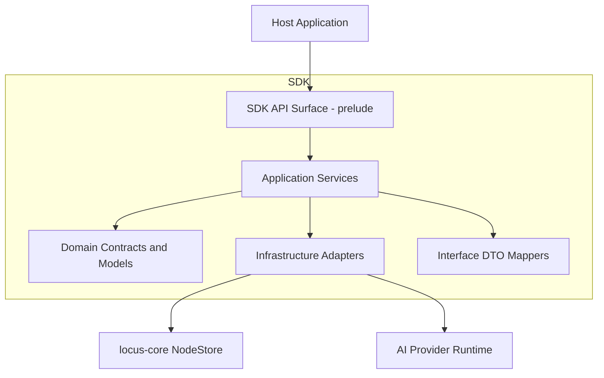
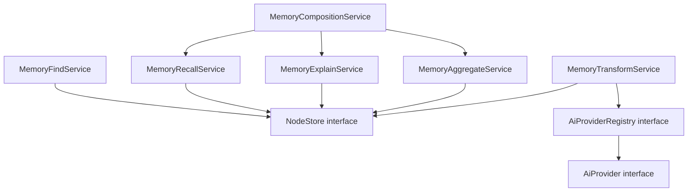
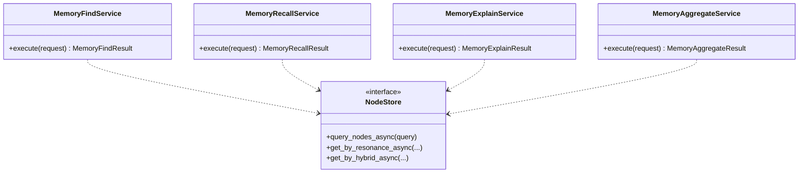
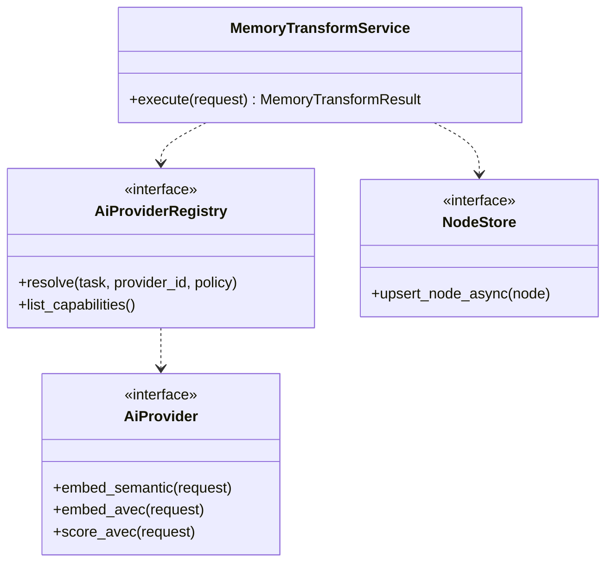
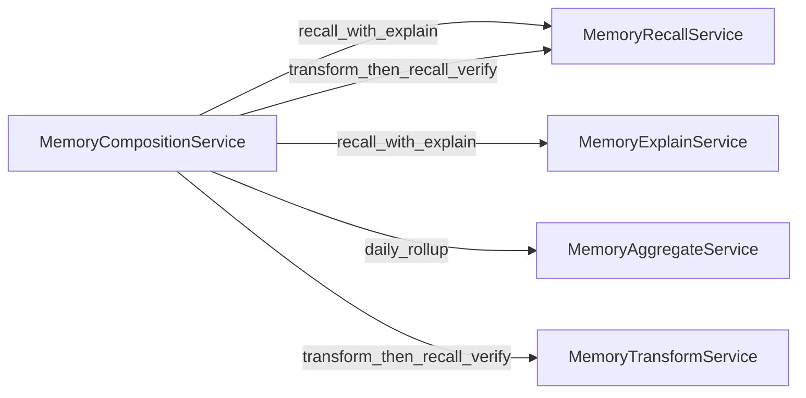
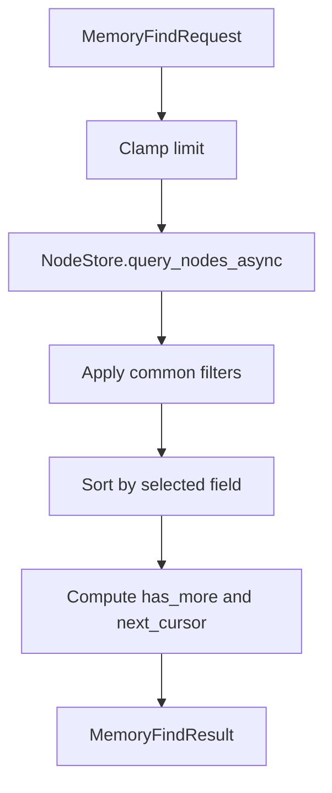
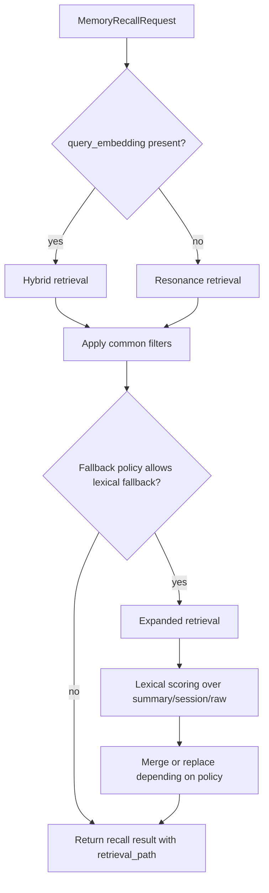
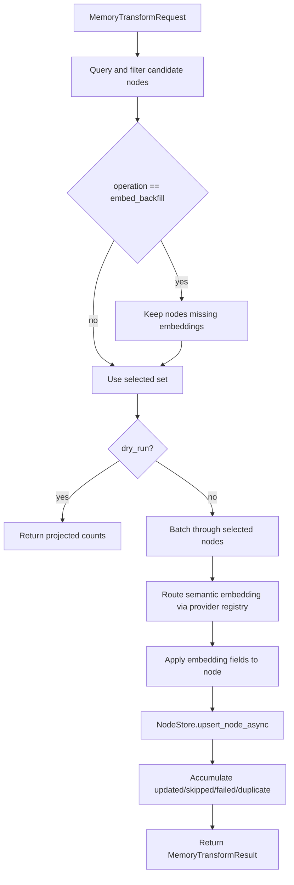

# Locus SDK Architecture Specification

## Document Control
- Document ID: LOCUS-SDK-ARCH-001
- Status: Draft for Internal Review
- Intended Audience: SDK Maintainers, Integrators, Architecture Review Board
- Source of Truth: `locus-sdk` implementation (`application/*`, `domain/*`, `infrastructure/*`, `interface/*`)
- Last Updated: 2026-05-04

## 1. Purpose and Scope
This document defines the architecture of `locus-sdk`, including module boundaries, service orchestration, extension points, and operational behavior.

Objectives:
- Make component responsibilities explicit.
- Reduce integration risk for host applications.
- Preserve backward-compatible architecture evolution.

## 2. Layered Architecture Overview

Layer intent:
- `prelude`: stable ergonomic import surface for consumers.
- `application`: orchestration services and workflow composition.
- `domain`: neutral request/result types and provider contracts.
- `infrastructure`: concrete adapters and registries.
- `interface`: DTO translation boundary for transport adapters.

## 3. Module Decomposition
### 3.1 Domain Layer
- `domain/memory.rs`: canonical memory query/recall/aggregate/transform contracts.
- `domain/ai.rs`: provider capability model and routing contracts.
- `domain/compression.rs`: manual compression request/result schema.

### 3.2 Application Layer
Primary services:
- `MemoryFindService`
- `MemoryRecallService`
- `MemoryExplainService`
- `MemoryAggregateService`
- `MemoryTransformService`
- `MemoryCompositionService`
- `MemorySchemaService`
- `ManualCompressionService`
- AI routing helpers (`ai_router.rs`, `routing_config.rs`)

### 3.3 Infrastructure Layer
- `InMemoryAiProviderRegistry`
- `GenaiProviderAdapter` (feature-gated)
- `SttpEmbeddingProviderAdapter`
- `OllamaEmbeddingProvider`
- `LocalEmbeddingProvider` (feature `local-embedding`)

### 3.4 Interface Layer
- `interface/dto.rs`: bidirectional mapping between SDK-native types and DTO structs.

## 4. Core Service Topology (UML)

### 4.1 Query and Retrieval Services

### 4.2 Transform and Provider Resolution

### 4.3 Composition Workflow Wiring

## 5. Request Lifecycle Patterns
### 5.1 Find Path

### 5.2 Recall Path with Fallback

### 5.3 Transform Path

## 6. AI Routing and Provider Resolution
Routing semantics:
- `route_embedding` dispatches by `AiTask` (`SemanticEmbedding` or `AvecEmbedding`).
- `route_avec_score` dispatches scoring requests.

Provider selection (`AiProviderRegistry.resolve`):
- Explicit `provider_id` must exist and support requested task.
- `ProviderPolicy::Required` requires explicit provider id.
- `Auto` and `Preferred` select first provider supporting the task.

`AiRoutingConfig` responsibilities:
- Default provider fallback.
- Task-specific model selection per provider.
- Request mutation helper methods (`apply_to_embed_request`, `apply_to_score_request`).

## 7. Data Contracts and Guardrails
Memory contract characteristics:
- Scope controls: tenant/session/tier/time.
- Filter controls: embedding presence/model, metric ranges, lexical contains.
- Scoring controls: alpha/beta and fallback policy.

Clamp guardrails:
- `clamp_limit`: 1..200.
- `clamp_groups`: 1..5000.
- `clamp_nodes`: 1..50000.
- `clamp_batch_size`: 1..500.

These guardrails are enforced before expensive operations.

## 8. Composition Workflows
`MemoryCompositionService` encapsulates higher-level workflows:
- `recall_with_explain`: single request emits both retrieval and explain trace.
- `daily_rollup`: aggregate by day over filtered scope.
- `transform_then_recall_verify`: execute transform, then immediate recall verification.
- `build_content_from_text`: deterministic structured content generation using manual compression and role-based AVEC resolution.

Composite content building constraints:
- Maximum recursion depth clamped to 5.
- Can require explicit AVEC overrides unless LLM fallback is allowed.
- Emits confidence-annotated structured JSON fields.

## 9. Infrastructure Adapters and Feature Gating
- `GenaiProviderAdapter` behind `genai-provider` feature.
- `LocalEmbeddingProvider` behind `local-embedding` feature.
- `OllamaEmbeddingProvider` always available.
- `SttpEmbeddingProviderAdapter` wraps `locus-core` `EmbeddingProvider` into SDK `AiProvider` shape.

Operational note:
- Local embedding uses CPU-bound worker and blocking-task isolation for runtime safety.

## 10. DTO Boundary and Integration Strategy
`interface/dto.rs` provides:
- Inbound request conversion DTO -> domain model.
- Outbound response conversion domain model -> DTO.
- Composite workflow DTOs for composed service responses.

Design intent:
- Keep transport concerns out of domain/application layers.
- Preserve ability to evolve transport fields with additive mapping.

## 11. Reliability and Change Management Rules
Compatibility rules:
- Additive enums/fields are preferred evolution path.
- Existing defaults remain stable unless a versioned schema contract is introduced.
- New provider adapters must satisfy `AiProvider` capabilities explicitly.

Failure management principles:
- Partial batch failures are surfaced in `MemoryTransformResult.failures`.
- Fallback behavior is explicit and observable in explain outputs.
- Provider misconfiguration fails fast with structured errors.

## 12. Security and Operational Considerations
- Provider API keys and endpoints are externalized in host configuration.
- Text sent to embedding/scoring providers should be minimized to needed content.
- `MemoryTransformService` dry-run mode should be default for first execution in new environments.

## 13. Traceability to Implementation
Primary implementation locations:
- `locus-sdk/src/domain/memory.rs`
- `locus-sdk/src/domain/ai.rs`
- `locus-sdk/src/application/memory_find.rs`
- `locus-sdk/src/application/memory_recall.rs`
- `locus-sdk/src/application/memory_explain.rs`
- `locus-sdk/src/application/memory_aggregate.rs`
- `locus-sdk/src/application/memory_transform.rs`
- `locus-sdk/src/application/memory_composition.rs`
- `locus-sdk/src/application/routing_config.rs`
- `locus-sdk/src/infrastructure/registry.rs`
- `locus-sdk/src/infrastructure/embeddings.rs`
- `locus-sdk/src/interface/dto.rs`
